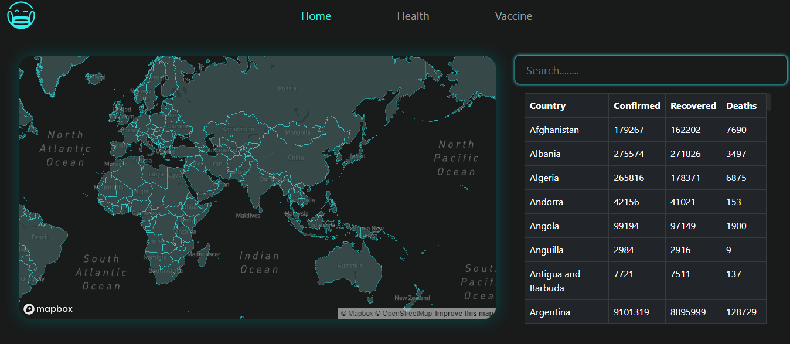
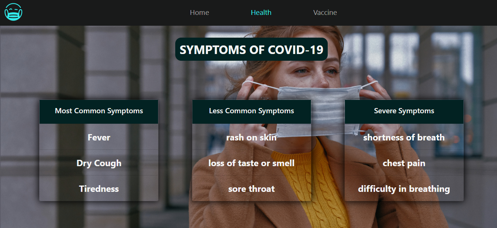
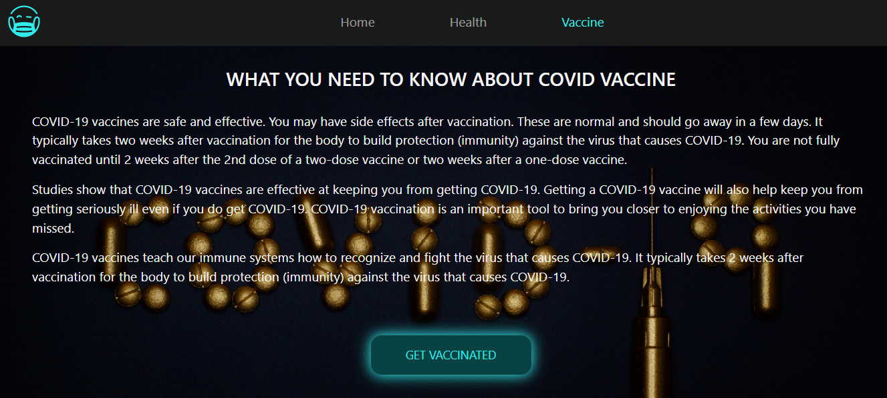

# Covid-Tracking
A Covid Cases Tracking App made using [Mapbox](https://www.mapbox.com/) and covid-19 API

## Technologies
Build with:
* HTML5
* CSS3
* Javascript  

## Features 
* Users can view the covid cases in their respective country.
* Users can also search for covid cases in various countries around the world!
* Users can get a notification if the number of cases rises above the limit specified by the user.
* Curated list of exercise videos for post covid users.
* Much more other helpful information related to covid-19 and its vaccine.

## Roadmap
* Allow users to book vaccine slots.
* Personal Diet plan to follow (limited time) for post covid users.
* Daily covid cases notification to keep the user updated.
* Email notifications instead of Desktop notifications.

## Preview

